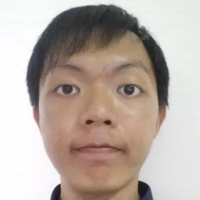
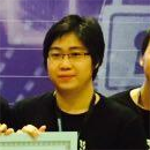
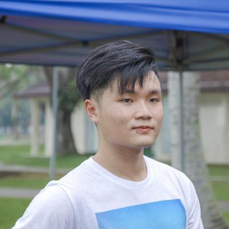

<!-- @@author A0139938L -->
# About Us

We are a team based in the [School of Computing, National University of Singapore](http://www.comp.nus.edu.sg).

## Project Team
<!-- @@author A0139410N -->
#### [Teo Tian Song](http://github.com/ephyra)
 
Role: Developer  
Responsibilities: Code Quality + Eclipse expert + Model

-----
<!-- @@author A0138664W -->
#### [Mustaqiim Muhar](http://github.com/mustaqiimuhar)
 
Role: Developer  
Responsibilities: Testing + Storage + Documentation

-----
<!-- @@author A0146789H -->
#### [Jeremy Heng](http://github.com/nnamon)
 
Role: Developer  
Responsibilities:  Integration + Git expert + Parser & Logic

-----
<!-- @@author A0139938L -->
#### [Shawn Lin](https://github.com/e0003823)

Role: Developer

Responsibilities: Team Lead + Deadlines, Deliverables (admin stuff)  + UI

-----
