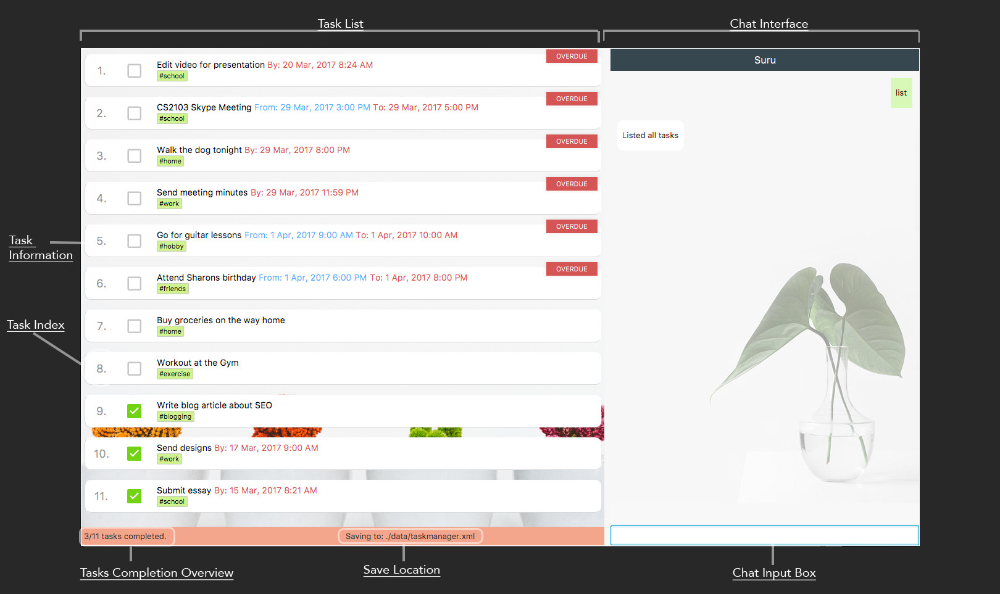

<!--@@author A0139938L-->
# Suru - User Guide

By : `W09-B3`  &nbsp;&nbsp;&nbsp;&nbsp; Since: `Feb 2017`  &nbsp;&nbsp;&nbsp;&nbsp;

---

1. [Introduction](#1-introduction)
2. [Quick Start](#2-quick-start)
3. [Features](#3-features)
	1. [Viewing user guide](#31-viewing-user-guide-help)
	2. [Adding tasks](#32-adding-tasks)
	3. [Editing tasks](#33-edit-tasks-edit-index-task-details)
	4. [Deleting Tasks](#34-deleting-tasks-delete-index)
	5. [Listing](#35-listing)
	6. [Search](#36-search-for-tasks-findsearch-keywords)
	7. [Select](#37-select-tasks-select-index)
	8. [Marking tasks as completed or incomplete](#38-marking-tasks-as-completed-or-incomplete)
	9. [Undo and Redo](#39-undo-and-redo)
	10. [Saving and Loading](#310-saving-and-loading)
	11. [Email Reminders](#311-email-reminders)
	12. [Accepted date and time inputs](#312-accepted-date-and-time-inputs)
	13. [Exiting the app](#313-exiting-the-app-exit)
4. [FAQ](#4-faq)
5. [Command Summary](#5-command-summary)

## 1. Introduction

Welcome to Suru, the innovative personal assistant designed to help manage your tasks like a boss. This guide will help you install Suru on your computer and show you how to get the most out of your chatbot.

## 2. Quick Start

0. Before we begin, please ensure you have [Java version `1.8.0_60`](http://www.oracle.com/technetwork/java/javase/downloads/jdk8-downloads-2133151.html) or later installed in your computer.

   > Having any Java 8 version is not enough.
   > This app will not work with earlier versions of Java 8.

1. Download the latest `suru.jar` from the [releases](../../../releases) tab.
2. Copy the file to a folder you want to use as the home folder for Suru.
3. Double-click the file to start Suru. The app should start in a few seconds and you should see an interface similar to this: 
4. Type a command in the command box and press <kbd>Enter</kbd> to execute it
   e.g. typing **`help`** and pressing <kbd>Enter</kbd> will open the help window.
5. Some sample commands you can try:
   * **`add`**` write essay `**`by`**` 13/3/17` : adds a task "write essay" with a due date of "13th March 2017"
   * **`delete`**`1` : deletes the 1st task shown in the current list
   * **`list`** : lists all of your tasks

   * **`exit`** : exits the app
6. Refer to the [Features](#3-features) section below for details of each command.

## 3. Features

> **Command format**
>
> * Items in `UPPER_CASE` are the parameters.
> * Items in `SQUARE_BRACKETS` are optional.
> * Items with `...` after them can have multiple instances.
> * Parameters can be in any order.

> **Saving the data**
>
> By default, data is saved in the hard disk automatically after each command.
There is no need to save manually.

### 3.1. Viewing user guide: `help`
A help window containing the user guide is opened.

### 3.2. Adding tasks

#### 3.2.1. Adding a simple task with no specified dates: `add DESCRIPTION` 
To add a simple, non-urgent task, use the `add` command followed by the `DESCRIPTION` of your task.

Example:

* add `write essay`

> A simple task with the description `write essay` is added to your task list.

#### 3.2.2. Adding a task with a deadline: `add DESCRIPTION by|on DUE_DATE`
This command applies to tasks with a deadline, such as assignment submissions. To specify a deadline for a task, use the keywords `by` or `on` followed by your desired `DUE_DATE`.

Example:
* add `write essay` by `7/13/17`

> Adds a new task `write essay` that is due on `13th July 2017`.

#### 3.2.3. Adding an event: `add DESCRIPTION from START_TIME to END_TIME`
Events such as birthday parties and movies have both a start and end time. Suru helps you to keep track of these events with this command.

Example:
* add `attend birthday party` from `8pm` to `10pm`

> Adds a new event `attend birthday party` that is happening from `8pm` to `10pm` on the same day.

#### 3.2.4. Adding a task with tags: `add... #TAGNAME`

Tagging your tasks can be a great way to get organized.

Examples:

* add `write essay` from `7/13/17` to `7/15/17` `#school` `#homework`
> Adds a new task `write essay` that lasts from `13th July 2017` to `15th July 2017` with the tags `#school` and `#homework`.

* add `write essay` `#blogging`
> Adds a new task `write essay` with a tag `#blogging`.

#### 3.2.5. Adding tags to an existing task: `addtag INDEX #TAGNAME`

You can also add tags to tasks that already exist in your task list.

Example:
* addtag `1` `#history`
> Adds a tag `#history` to the first task in the list.

<!--@@author A0146789H-->

### 3.3. Editing tasks: `edit INDEX [TASK DETAILS]`

Things don't always go according to plan. For instance, an assignment's deadline may be pushed forward or an event may be postponed. Suru allows you to easily edit your tasks to stay updated with these changes.

Examples:

* list  
edit `1` `write essay` by `5/13/17` 
> Edits the description of the selected task to `write essay` and deadline to `5/13/17`.

* list  
edit `2` `watch a movie` from `next tuesday 6pm` to `next tuesday 8pm` 
> Edits the description of the 2nd task in the list to be `watch a movie` with a start time of `6pm` and an end time of `8pm` on next Tuesday's date.

### 3.4. Deleting tasks: `delete INDEX`
Tasks that have been completed long ago or cancelled altogether should be removed from your task list. Suru allows you to delete tasks from your task list with the `delete` command.

Example:

* list  
  delete `2`  
> Deletes the 2nd task in the list.

#### 3.4.1 Deleting tags in a task: `deltag INDEX #TAGNAME`

You can also remove tags from an existing task by using the `deltag` command.

Example:

* deltag `2` `#homework` 
> Deletes the tag `#homework` from the 2nd task in the list.

#### 3.4.2 Clearing all tasks: `clear`
This command deletes all the tasks from your task list.

### 3.5. Listing
Suru automatically sorts your tasks according to their due date so that your most urgent tasks are always at the top!

#### 3.5.1. Listing all tasks: `list`
Suru displays a list of all your tasks.

#### 3.5.2. Listing unchecked tasks: `list unchecked`
Unchecked tasks are tasks that are still pending and not completed yet. With this command, Suru displays a list of all unchecked tasks.

#### 3.5.3. Listing checked tasks: `list checked`
Checked tasks are tasks that are already marked as completed. This command shows you a list of all checked tasks.

#### 3.5.4. Listing tagged tasks: `list #TAGNAME`

Shows a list of all tasks that match the specified `#TAGNAME`.

Example:
* list `#school`
> This command shows you all your tasks that are tagged with `#school`.

#### 3.5.5 Listing overdue tasks: `list overdue`
Shows a list of all overdue tasks. Overdue tasks are tasks whose deadlines have passed but are not yet completed.

#### 3.5.6 Listing upcoming tasks: `list upcoming`
Shows a list of all upcoming tasks. Upcoming tasks are tasks that are due in the next 3 days.

#### 3.5.7 Listing simple tasks: `list someday`
Shows a list of tasks with no start or end dates. Since you can do them anytime you want, we call them "someday" tasks.

### 3.6. Search for tasks: `find|search KEYWORDS...`
Over time, you may start having a large number of tasks stored in Suru. Fortunately, Suru allows you to easily find tasks by searching for them.

> * The search is **NOT** case sensitive e.g `write` will match `Write`.
> * The order of the keywords does not matter e.g. `Write Essay` will match `Essay Write`.
> * Only `DESCRIPTIONS` and `TAGNAMES` are searched.
> * Only full words will be matched e.g. `Ess` will not match `Essay`.
> * Tasks matching at least one keyword will be returned
    e.g. `Essay` will match `Essay Writing Competition`.

Examples:

* find `Essay` 
> Returns `Write Essay` and `essay writing`.
* search `Essay Writing Competition` 
> Returns all tasks having keywords `Essay`, `Writing`, or `Competition`.

### 3.7. Select tasks: `select INDEX`
View more information regarding a task by using the `select` command.

### 3.8. Marking tasks as completed or incomplete
Suru allows you to check off your tasks as you complete them. When a task is completed, it moves to the bottom of the list so that you can focus on your most important tasks at the top.

#### 3.8.1 Checking off a task: `check INDEX`

Checks off a task to indicate that it has been completed.

Examples:

* list  
  check `2`  
> Checks off the 2nd task in the listing.
  
* find `Essay`  
  check `1`  
> Checks off the 1st task in the results of the `find` command.

#### 3.8.2 Unchecking a task: `uncheck INDEX`

Unchecks a task to indicate that it is incomplete.

Examples:

* list 
  uncheck `2` 
> Unchecks the 2nd task in the listing.
* find `Essay` 
  uncheck `1` 
> Unchecks the 1st task in the results of the `find` command.

### 3.9 Undo and redo
People can make mistakes. Thankfully, Suru makes it easy to undo any accidents.

#### 3.9.1 Undoing a command: `undo`

Reverses your previous command.

> Only reverses operations that alter data, i.e. `add`, `edit` and `delete`.

#### 3.9.2 Redoing an undone command: `redo`

Reverses your previous undo operation.

<!--@@author A0138664W-->

### 3.10 Saving and loading

#### 3.10.1 Setting save destination: `saveto|save|export FILE_PATH`
Allows you to save to another file.

Note:
> * The `FILE_PATH` should be the address of the file you wish to save your tasks to.
> * Only XML files that comply with Suru's storage format are accepted.

Example:

* saveto `C:/Suru/suru-data.xml`
> Changes the save location to the specified file path and writes to that file.

#### 3.10.2 Setting target to load from: `loadfrom|load|import FILE_PATH`
Allows you to load data from another file.

> * The `FILE_PATH` should be the address of the file you wish to load your tasks from.
> * Only XML files that comply with Suru's storage format are accepted.

Example:

* loadfrom `C:/Suru/suru-data.xml`
> Loads data from an external file at the specified file path and updates Suru's task list.

### 3.11. Email Reminders
Suru sends reminders via email for all your tasks. This means that as long as you have your email set up, you can get reminders on any device!

#### 3.11.1 Setting preferred email: `email EMAIL_ADDRESS`
First, set up your email with this command.

Example:
* email `shawn@suru.com`
Suru will now send email reminders to this `shawn@suru.com`

#### 3.11.2 Enabling reminders: `reminders enable`
This command enables reminders for Suru. 

Note:
> * Reminders are sent out for all tasks that have a start time.
> * Suru sends reminders 1 hour before the task's start time.
>     * The reminder duration is not editable in this version of Suru.

After executing this command, Suru will send email reminders to the specified email.

#### 3.11.3 Disabling reminders: `reminders disable`

This command disables reminders for Suru. 

After executing this command, Suru will stop sending email reminders.

<!-- @@author A0139410N -->

### 3.12. Accepted date and time inputs
Suru accepts a wide range of natural date and time inputs to make it as comfortable as possible for you to manage your tasks.

#### 3.12.1 Accepted date Inputs:

|Numbers & Slashes|Months|Relative Dates|
|-----|--------|---|
| 04/11/2017 (MM/DD/YYYY) | 11 April 2017 |Today|
| 04/11/17 (MM/DD/YY) | 11 Apr |Tomorrow/Tmr|
| 04/11 | Apr 11  |Yesterday|
| | |Last/next week|
| | |3 days ago/later|
| | |Last/next month|
| | |Last/next year|

#### 3.12.2 Accepted time inputs:
|24-hr notation|AM/PM|Presets|
|---|---|---|
|08:00|8am|Morning(8am)|
|1200h|12.00pm|Afternoon(12pm)|
|1900|7pm|Evening(7pm)|
| |8pm| Night(8pm)|

### 3.13. Exiting the app: `exit`
Exits Suru.

Format: `exit`

## 4. FAQ

1. How do I transfer my data to another Computer?

    **A**: Install the app in the other computer and use the `loadfrom` command to specify your desired directory to load data from.

2. Does Suru sync my data across different devices?

    **A**: Unfortunately, Suru currently does not offer support to sync your data across different devices. Alternatively, you can specify your save location in a synced folder (such as a Dropbox folder) on your computer using the [`saveto`](#3101-setting-save-destination-savetosaveexport-file-path) command. Thereafter, simply use the [`loadfrom`](#3102-setting-target-to-load-from-loadfromloadimport-file-path) command on your other device to retrieve your synchronized data.

4. Where can we seek further assistance for Suru?

    **A**: Feel free to contact us at e0003823@u.nus.edu.

## 5. Command Summary

|Command|Syntax|Examples|
|-------|--------|------|
|[**add, -a**](#32-adding-a-task)|`add DESCRIPTION from START_DATE to END_DATE`   `#TAGNAMES...`| `add Write essay` `add Write essay by 12/24/17` `add Write essay from 12/24/17 to 12/24/17`|
|[**addtag**](#325-adding-tags-to-an-existing-task-addtag-index-tagname)|`addtag #TAGNAME`|
|[**check, complete**](#381-checking-off-a-task-check-index)|`check INDEX`|`list` > `check 1`
|[**clear**](#342-clearing-all-tasks-clear)|`clear`||
|[**delete, remove, del, -d**](#34-deleting-tasks-delete-index)|`delete INDEX`|`delete 3`|
|[**deltag**](#341-deleting-tags-in-a-task-deltag-index-tagname)|`deltag #TAGNAME`|
|[**edit, change, -e**](#33-edit-task-edit-index-task-details)|`edit INDEX`|`edit 2 buy groceries` `edit 1 buy groceries by 5/13/17`|
|[**email**](#3111-setting-preferred-email-email-email-address)|`email EMAILADDRESS`|`email shawn@suru.com`|
|[**exit, quit**](#313-exiting-the-app-exit)|`exit`||
|[**find, search**](#36-search-for-tasks-findsearch-keywords)|`find KEYWORD [MORE_KEYWORDS]`|`find Essay` `find Essay Jogging`|
|[**help**](#31-viewing-user-guide-help)|`help`||
|[**list**](#35-listing)|`list`|`list unchecked` `list checked`   `list overdue`   `list upcoming`   `list someday`|
|[**loadfrom, load, import**](#3102-setting-target-to-load-from-loadfromloadimport-file-path)|`loadfrom FOLDER_PATH`|`loadfrom C:/Suru/import.xml`|
|[**redo**](#392-redoing-an-undone-command-redo)|`redo`||
|[**reminders**](#3112-enabling-reminders-reminders-enable)|`reminders enable/disable`||
|[**saveto, save, export**](#3101-setting-save-destination-savetosaveexport-file-path)|`saveto FOLDER_PATH`|`saveto C:/Suru/export.xml`|
|[**select**](#37-select-tasks-select-index)|`select INDEX`|`select 1`|
|[**uncheck, incomplete**](#382-unchecking-a-task-uncheck-index)|`uncheck INDEX`|`list` > `uncheck 1`|
|[**undo**](#391-undoing-a-command-undo)|`undo`||

